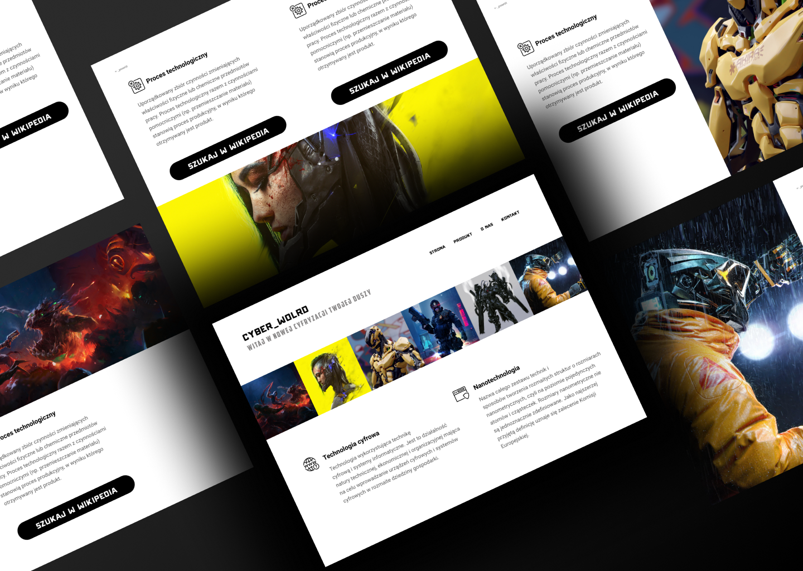

# CYBER_WORLD :floppy_disk:

## Description
My first independent project of a website that also has its subpages :heart:
###
How I did it:
1. I designed the look of the website with the help of Adobe Xd
2. I downloaded the images and basic HTML/CSS code thanks to the Adobe Xd plugin
3. I started work by creating subpage files for my homepage
4. Instead of writing CSS code, I used the SASS preprocessor
5. I tried to use the Bootstrap framework as often as possible
###
The whole thing looks very beautiful. SASS has greatly facilitated my work on responsiveness and arrangement of text and images. And thanks to Bootstrap, I easily managed the grid in the HTML code :neckbeard:
###
Check out what happens when you click on the links on each page :stuck_out_tongue_winking_eye:

## Technologies used
- HTML
- CSS
- SASS
- Bootstrap

# My Portfolio :smiling_imp:
### [Behance](https://www.behance.net/karolkomor1b9a) :computer:

### [Github](https://github.com/FLaMeREVENGE) :paw_prints:

